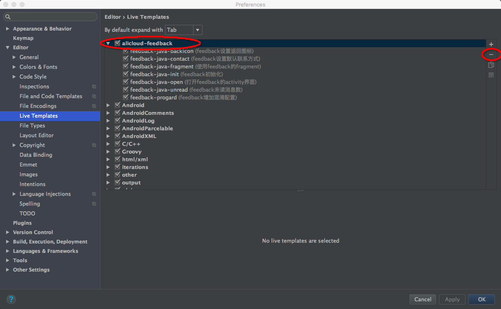
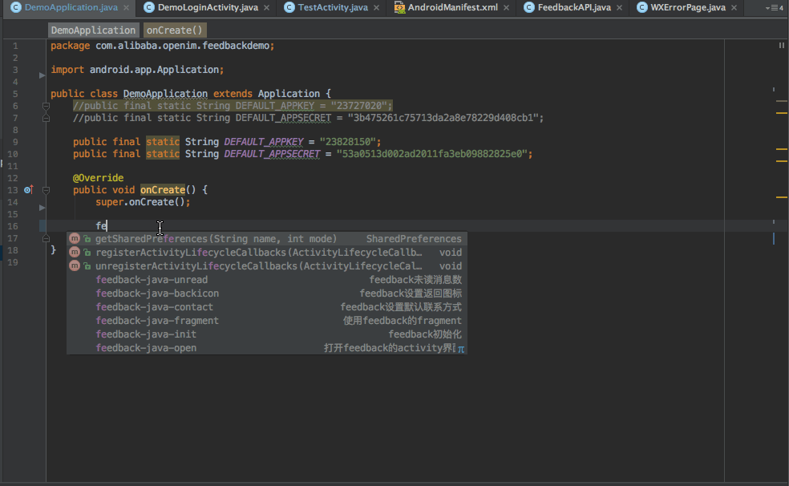
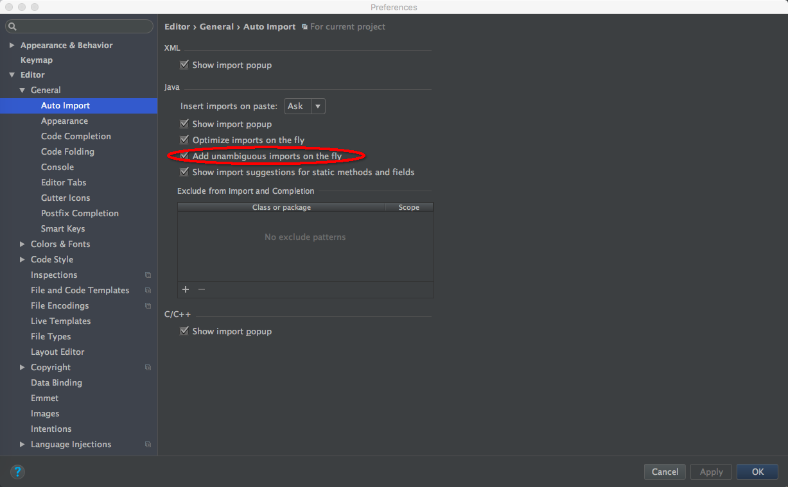

## 移动用户反馈AndoridStudio Live Templates

### 1 说明

`AndroidStudio Live Templates`支持提前设定好一些通用冗长代码片段，在使用时只需输入简单缩写IDE即可补全所有代码，通过live templates规范移动用户反馈SDK使用主要有两个优势：

- 提高接入效率，方便用户接入测试
- 规避因书写错误而导致的bug，减少问题排查成本

### 2 使用

在AndroidStudio中选择"File->import settings",导入FeedbackLiveTemplates.jar文件即可。

### 3 删除

“AndroidStudio->Preferences->Editor->Live Templates”,将alicloud-feedback删除即可:

### 4 使用示例

### 5 Feedback SDK LiveTemplates列表

| 模板名(shortcut)          | 对应功能         |
| ---------------------- | ------------ |
| feedback-java-init     | 初始化代码模板      |
| feedback-java-open     | 打开反馈模板       |
| feedback-java-unread   | 获取未读消息数模板    |
| feedback-java-fragment | 使用fragment模板 |
| feedback-java-contact  | 设置默认联系方式模板   |
| feedback-java-backicon | 设置返回按钮图片模板   |
| feedback-progard       | 混淆模板         |

### 6 不能自动导入包名问题的解决

勾选上图中红圈处的选项即可。