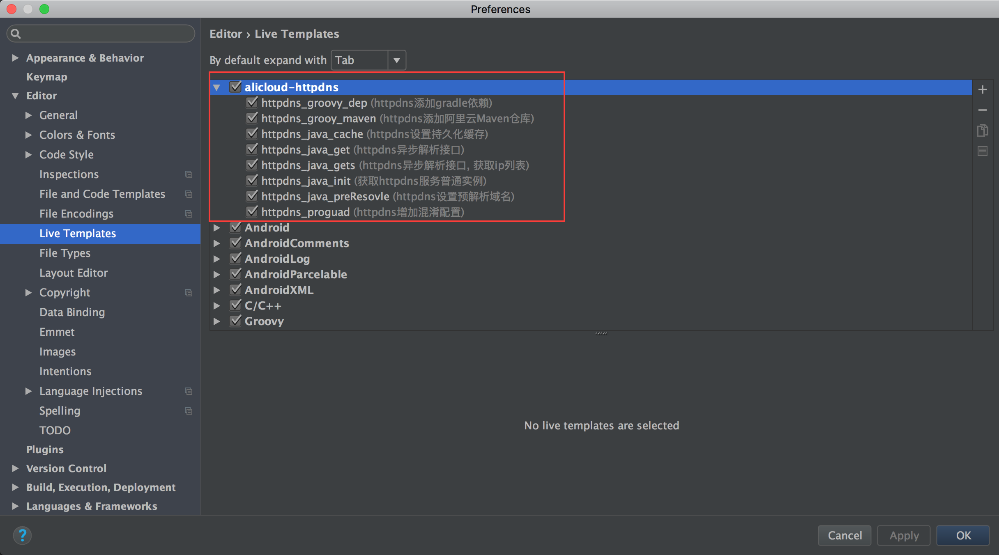

# HTTPDNS AndroidStudio LiveTemplates

## 安装

在AndroidStudio中选择`File->import settings`,导入[httpdns_settings.jar](https://github.com/aliyun/aliyun-ams-ueo/raw/master/Android/Httpdns/assets/httpdns_settings.jar)文件。

## 移除

httpdns相关的live templates在`alicloud-httpdns`目录下，打开`AndroidStudio->Preferences->Editor->Live Templates`去掉勾选：

## 示例

## HTTPDNS SDK LiveTemplates列表

模板名(shortcut)|对应功能
---|---
httpdns_groovy_dep|httpdns添加gradle依赖
httpdns_groovy_maven|httpdns添加阿里云Maven仓库
httpdns_java_cache|httpdns设置持久化缓存
httpdns_java_get|httpdns异步解析接口
httpdns_java_gets|httpdns异步解析接口, 获取ip列表
httpdns_java_init|获取httpdns服务普通实例
httpdns_java_preResovle|httpdns设置预解析域名
httpdns_proguad|httpdns增加混淆配置