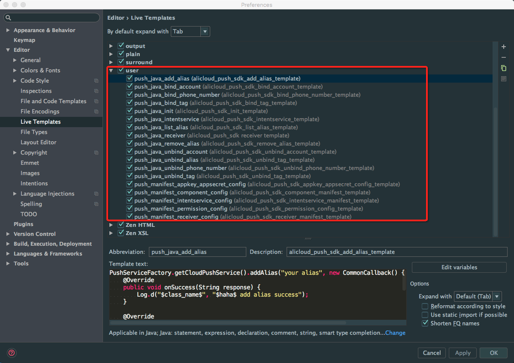

## 移动推送AndoridStudio Live Templates

### 1 使用

在AndroidStudio中选择"File->import settings",导入[PushLiveTemplates.jar](assets/PushLiveTemplates.jar)文件即可。

### 2 删除

“AndroidStudio->Preferences->Editor->Live Templates”,所有push相关的live templates在`user`路径下,并均以`push_`开头，删除即可:

### 3 使用示例

### 4 MPush SDK LiveTemplates列表

| 模板名(shortcut)                         | 对应功能                           |
| ------------------------------------- | ------------------------------ |
| push_java_init                        | 初始化代码模板                        |
| push_java_bind_account                | 绑定账号模板                         |
| push_java_unbind_account              | 解绑账号模板                         |
| push_java_bind_phone_number           | 绑定电话模板                         |
| push_java_unbind_phone_number         | 解绑模板                           |
| push_java_bind_tag                    | 绑定tag模板                        |
| push_java_unbind_tag                  | 解绑tag模板                        |
| push_java_list_tag                    | 获取tag列表模板                      |
| push_java_add_alias                   | 添加别名模板                         |
| push_java_remove_alias                | 删除别名模板                         |
| push_java_list_alias                  | 删除别名模板                         |
| push_java_receiver                    | 用户receiver代码模板                 |
| push_manifest_receiver_config         | 用户receiver manifest文件配置模板      |
| push_java_intentservice               | 用户intentservice代码模板            |
| push_manifest_intentservice_config    | 用户intentservice manifest文件配置模板 |
| push_manifest_component_config        | SDK组件配置manifest模板              |
| push_manifest_appkey_appsecret_config | manifest文件配置appkey、appsecret模板 |
| push_manifest_permission_config       | manifest文件权限配置模板               |