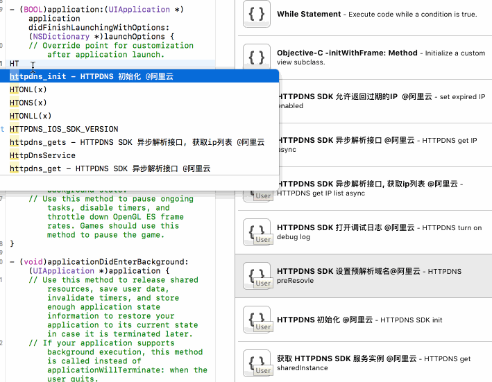

# iOS Xcode Objective-C Code Snippets

## 使用说明

- 适用于Objective-C编程。

### 导入

将`snippets/`目录下的`*.codesnippet`拷贝到Xcode Code Snippets管理目录：`~/Library/Developer/Xcode/UserData/CodeSnippets`。

```
cp ~/snippets/*.codesnippet ~/Library/Developer/Xcode/UserData/CodeSnippets/
```

### 删除

推送每条snippet里都有`HTTPDNS`关键字，执行下面脚本将推送相关snippet删除。

```
grep -l "HTTPDNS" ~/Library/Developer/Xcode/UserData/CodeSnippets/* | xargs rm
```

### 使用示例



## Snippets说明


Snippet说明 | Shortcut
--- | ---
HTTPDNS SDK 初始化 | `httpdns_init`
获取 HTTPDNS SDK 服务实例 | `httpdns_share`
HTTPDNS SDK 打开调试日志 | `httpdns_log`
HTTPDNS SDK 允许返回过期的IP | `httpdns_expire`
HTTPDNS SDK 异步解析接口 | `httpdns_get`
HTTPDNS SDK 异步解析接口, 获取ip列表 | `httpdns_gets`
HTTPDNS SDK 设置预解析域名 | `httpdns_preResovle`

